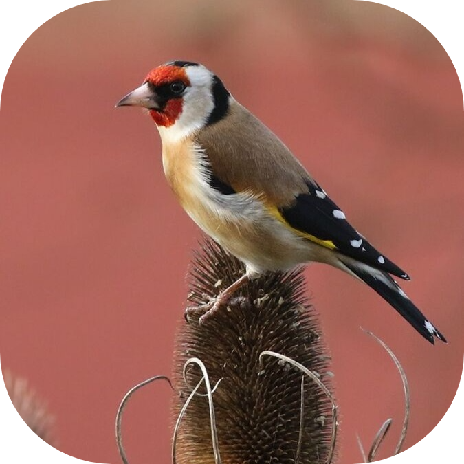

# Goldfinch

Goldfinch is a small RDF triplestore written in C. RDF data is stored as subject,
predicate, and object triples. Strings are assigned numeric IDs so the
triplestore can compare and store values efficiently.

## Architecture

```text
main.c
	|
	+-- storage/   RDF data loading and in-memory storage
	|
	+-- engine/    Triple-pattern matching and query results
	|
	+-- csparql/   Planned SPARQL lexer and parser
```

### Storage

The `storage` module owns the RDF data model and its in-memory structures:

- `triplestore.c`: creates the triplestore, inserts triples, counts triples,
  and releases triplestore memory.
- `dictionary.c`: maps RDF strings to numeric IDs and maps IDs back to strings.
- `hashtable.c`: stores and finds dictionary entries.
- `fetcher.c`: loads triples from Turtle files using Raptor2.

Headers are in `storage/include` and implementations are in `storage/src`.

### Engine

The `engine` module searches the stored triples. It accepts a triple pattern
where each of subject, predicate, and object can be fixed or variable. It
returns matching triples in a dynamically allocated `Results` structure.

Headers are in `engine/include` and the implementation is in `engine/src`.

### CSparql

The `csparql` module provides the query language layer. It currently includes
tokenization, parsing, and execution for a basic `SELECT` query.

Current stages:

1. The lexer converts SPARQL text into tokens.
2. The parser converts tokens into a parsed query structure.
3. The executor converts the parsed triple pattern into an engine call.
4. The executor prints values for the selected variables.

Next planned stages:

1. Expand the grammar beyond `SELECT`, `WHERE`, variables, IRIs,
   braces, and triple-pattern dots.
2. Add prefix declarations.
3. Add `ASK`, `INSERT DATA`, and `DELETE DATA` operations.

Example target query:

```sparql
SELECT ?person ?friend
WHERE {
		?person <http://xmlns.com/foaf/0.1/knows> ?friend .
}
```

## Building

The project uses GCC, Raptor2, and C17. From the repository root, build with:

````text
<p align="center">
	
</p>

# Goldfinch

Goldfinch is a small RDF triplestore written in C. It stores RDF data as
subject-predicate-object triples and is being built as a simple way to learn
how RDF storage and SPARQL query processing work together.

## How the data is stored

RDF data is kept in memory. Each triple has a subject, predicate, and object.
Instead of comparing long strings everywhere, Goldfinch gives each unique RDF
string a numeric ID through its dictionary. The triples store these IDs, which
makes comparisons smaller and faster.

The main storage pieces are:

- `fetcher.c` loads triples from Turtle files with Raptor2.
- `dictionary.c` maps RDF strings to numeric IDs and back again.
- `hashtable.c` finds dictionary entries quickly.
- `triplestore.c` stores triples and manages the triplestore.

## How SPARQL parsing works

The `csparql` directory contains the query-language work. A query is handled in
three steps:

1. The tokenizer reads the query and creates tokens such as `SELECT`, variables,
	 IRIs, braces, dots, and prefixed names like `ex:alice`.
2. The parser uses those tokens to build a structured query and identify the
	 triple pattern.
3. The executor sends that pattern to the engine, which searches the stored
	 triples and prints the selected values.

For example:

```sparql
PREFIX ex: <http://example.com/>

SELECT ?person
WHERE {
		?person ex:knows ex:alice .
}
````

## Current work

I am currently working on the SPARQL parser. The main focus is making tokenizing
and parsing reliable, especially for prefix declarations, prefixed names,
variables, IRIs, and triple patterns. More query types such as `ASK`, `INSERT`,
and `DELETE` can be added after the basic `SELECT` flow is solid.

## Project layout

```text
main.c       Program entry point and query experiments
storage/     RDF loading and in-memory triple storage
engine/      Triple-pattern matching
csparql/     Tokenizing, parsing, and query execution
```

## Building

Goldfinch uses GCC, C17, and Raptor2. From the project root, build with:

```text
gcc -g -I engine/include -I storage/include \
		-I csparql/include \
		-I C:/msys64/ucrt64/include \
		-I C:/msys64/ucrt64/include/raptor2 \
		main.c storage/src/dictionary.c storage/src/hashtable.c \
		storage/src/fetcher.c storage/src/triplestore.c engine/src/engine.c \
		csparql/src/token.c csparql/src/parse.c csparql/src/executor.c \
		-L C:/msys64/ucrt64/lib -lraptor2 -o triplestore.exe
```

The same build is available through the configured VS Code task.
